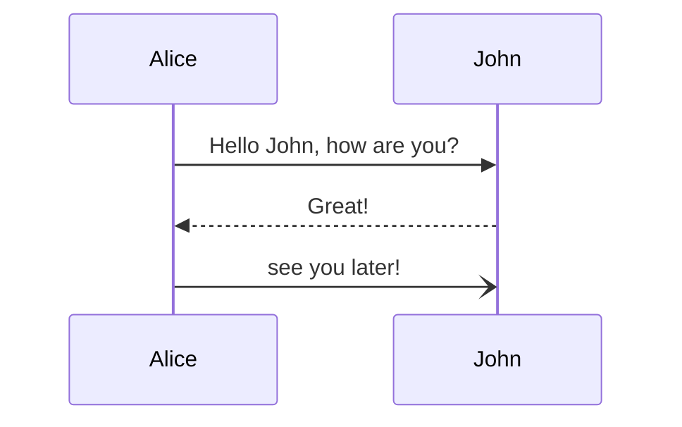

# learning-mermaid
Learning mermaid

# Mermaid in markdown github

## Graph

```mermaid
    graph TD;
        A-->B;
        A-->C;
        B-->D;
        C-->D;
```

## Sequence Diagrams

```mermaid
sequenceDiagram
    Alice->>John: Hello John, how are you?
    John-->>Alice: Great!
    Alice-)John: see you later!
```
