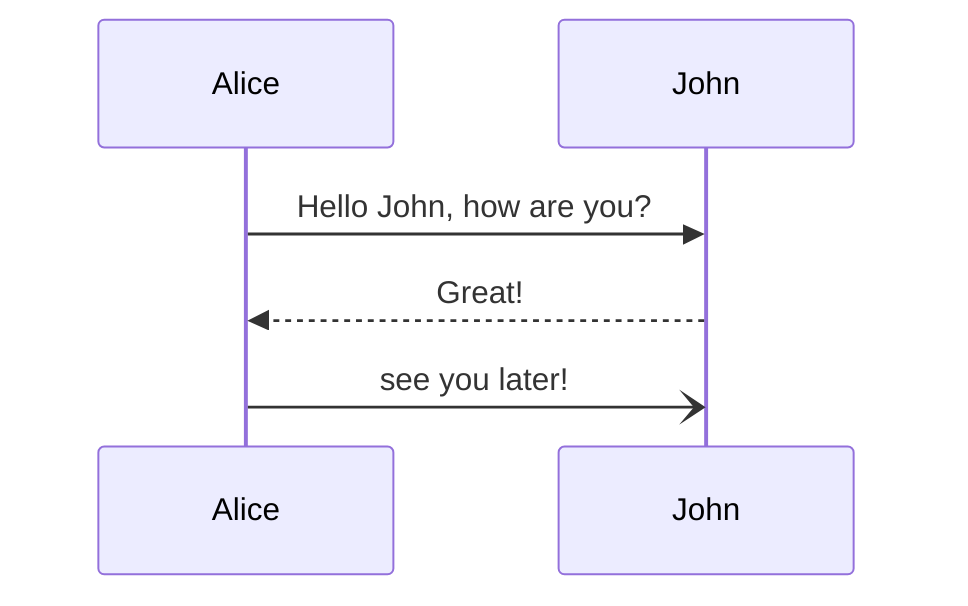
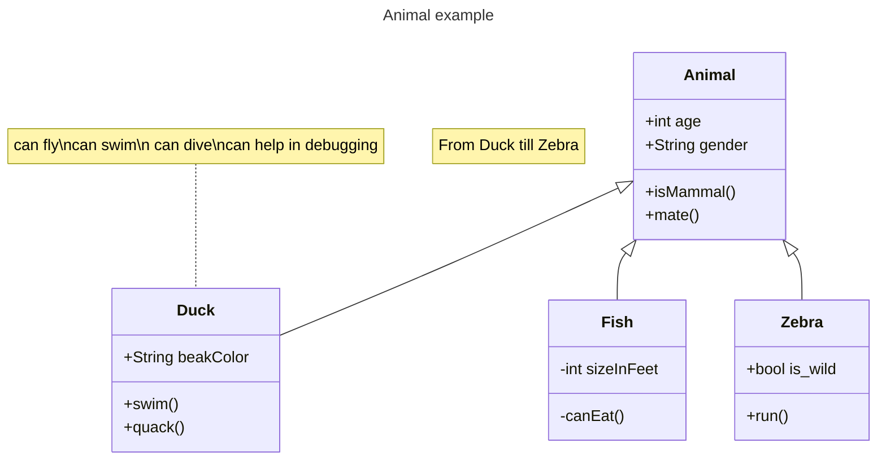

# learning-mermaid
Learning mermaid

[Including diagrams in your Markdown files with Mermaid](https://github.blog/2022-02-14-include-diagrams-markdown-files-mermaid/)

# Mermaid in markdown github

## Graph

## Sequence Diagrams

## Class Diagram

